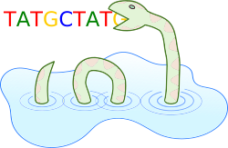
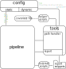

RNA SeA-SnaP   
============

*This is the master release candidate of SeA-SnaP*

RNA SeA-SnaP is a RNA-(Se)q (A)nalysis (Sna)kemake (P)ipeline tool and combines two tasks:

- A sub-pipeline mapping fastq files to a reference genome/transcriptome using `STAR` or `Salmon` and including extensive quality control (`Fastqc`, `Dupradar`, `Qualimap`, `RNASeQC`, `Preseq`, `infer_experiment`, `Multiqc`)
- A sub-pipeline for Differential Expression (DE) analysis with `DESeq2`

Both pipelines are based on [`Snakemake`](https://snakemake.readthedocs.io/en/stable/).

Outline
-------

- [Concept](#concept)
- [Quick-Start](#quick-start)
    - [Installation](#installation)
    - [Running the pipeline](#running-the-pipeline)
- [Development](#development)
    - [Adding Rmd snippets](documentation/adding_rmd_snippets.md)
    - [Adding new pipeline rules](documentation/adding_new_rules.md)
- [Config options](documentation/config_options.md)
- [SeA-SnaP options](#sea-snap-options)
- [Config examples](documentation/config_examples1.md)
- [Prepare input](documentation/prepare_input.md)
- [Hints](#hints)

Concept
-------

The focus of RNA SeA-SnaP is to be as easy to use, adapt and develop as possible.
To this end, SeA-SnaP is divided in three main parts:

- Pipeline: Nearly all code corresponding to a specific (sub-)pipeline is included in one file.
- Configuration: Setting parameters and pipeline configuration is done via a separate config file (YAML).
- Tools: Generic functions and tools that are part of the pipeline framework are located in a separate file.

Finally there is also a directory with R markdown snippets for the DE sub-pipeline.
Based on a configuration made in the config file, individual snippets can be assembled to generate a customized report.
The splitting into snippets allows to easily develop, share and include different analyses of the results.

Quick-Start
-----------

### Installation

After cloning this git repository:

```
git clone git@cubi-gitlab.bihealth.org:CUBI/Pipelines/sea-snap.git
```

all required tools and packages can be installed via conda.
Download and install them into a new environment called `sea_snap`:

```
conda env create -f conda_env.yaml
```

The file `conda_env.yaml` is located in the main directory of the git repository.
Each time before using SeA-SnaP, activate the environment with:

```
conda activate sea_snap
```

### Running the pipeline

**set up a working directory**

Set up a working directory to store the results produced by the pipeline.
(For CUBI projects create a project directory in the cluster under `/fast/groups/cubi/projects/`).
To create a directory and copy required files for the configuration of your pipeline run:

```
path/to/git/sea-snap.py working_dir
```

This will create a directory at the location from where you are running the command called `results_<year>_<month>_<day>/` and add config files for both pipelines, but you can customize this behaviour via the command line options (type `sea-snap.py working_dir -h` for help).
Directory names you provide can include formatting instructions for pythons [`time`](https://docs.python.org/3/library/time.html#time.strftime) package.

`cd <dir_name>` to the newly created working directory.
SeA-SnaP also creates a symbolic link to the sea-snap.py script, so that you can from now on use `./sea-snap` to run helpers or pipelines from the working directory.
You should always run pipelines and helpers from there.

---

**run the pipeline**

The next steps depend on, whether you want to run:

- [**`The mapping pipeline`**](documentation/run_mapping.md)
- [**`The DE pipeline`**](documentation/run_DE.md)
- [**`The sc pipeline`**](documentation/run_sc.md)

The results of an analysis can also be [`exported`](documentation/export.md) to a new folder structure, e.g. to upload them to SODAR.

---

Development
-----------

Let's first introduce the general structure of SeA-SnaP.

As outlined above, the pipeline core functionality is separated from additional generic tools like the path handler (that handles where files are stored) and the pipeline configuration.
The config file is loaded in Snakemake and its static parts (like parameter values) can be accessed in the pipeline rules.
For other 'dynamic' parts of the configuration like file paths which are described by path patterns or the report- and contrast configuration tools are provided that can be used within the pipeline to access this information.

In addition, there is also a directory with report snippets for the DE pipeline, small pieces of R-Markdown code that run a single analysis step like producing a PCA plot.
In the configuration file it can be set which snippets to use and in which order to assemble them into a full report.

<p align="center">
  
</p>

\
Finally, there are some helper functions, that can be accessed via the `./sea-snap` wrapper to e.g. automatically produce a covariate file or sample information.
There are also folders `external_scripts/`, where scripts can be placed that may be used in the pipeline (although it is prefereable if small pieces of code are kept inside of the Snakemake file), and `report/R_common/`, where R functions can be put that are generic and may be used in several report snippets.


The pipelines can be easily extended.

See the separate sections for:

- [**`Adding new .Rmd snippets`**](documentation/adding_rmd_snippets.md)
- [**`Adding new rules`**](documentation/adding_new_rules.md)
- [**`Sharing your code / gitlab repository`**](documentation/development.md)

---

SeA-SnaP options
----------------

Available commands in the `./sea-snap` wrapper:

helpers:

- `working_dir` to set up a new working directory for pipeline results
- `sample_info` to generate a yaml file with sample information used by the mapping pipeline
- `covariate_file` to generate a table with information required by the DE pipeline
- `select_contrast` display information to help choosing contrast definition

run pipeline:

- `mapping` run the mapping pipeline
- `DE` run the DE pipeline

Type `./sea-snap -h` or `./sea-snap COMMAND -h` for help.

Hints
-----

### understanding the reported number of reads (copied from old pipeline)

This has been inferred from single end data:

- STAR reports the total number of input reads, the number of uniquely mapped reads, the number of reads mapped to multiple loci (counted ones)
- STAR does not report directly the total number of unmapped reads, but the number of unmapped reads due to mapping to too many location
- feature counts reports in its summary file the total number of reads found in the alignment file: multi mapping reads are counted several times 
- hence by summing up all the numbers from feautureCount you will not get number of input reads as reported by STAR
- however, the number of unmapped reads should be the same amd summing up all but Unassigned_MultiMapping and Unassigned_Unmapped should give the uniqyely mapped reads reported by STAR

Help
----

Address questions to Patrick Pett (patrick.pett@bihealth.de)
