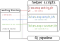
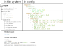

RNA SeA-SnaP   
============

RNA SeA-SnaP is a RNA-(Se)q (A)nalysis (Sna)kemake (P)ipeline tool and combines two tasks:

- A sub-pipeline mapping fastq files to a reference genome/transcriptome using STAR or Salmon
- A sub-pipeline for Differential Expression (DE) analysis

Both pipelines are based on [`Snakemake`](https://snakemake.readthedocs.io/en/stable/).

Outline
-------

- [Concept](#concept)
- [Quick-Start](#quick-start)
    - [Installation](#installation)
    - [Running the pipeline](#running-the-pipeline)
- [Config examples](#config-examples)
- [Prepare input](#prepare-input)
- [Development](#development)
    - [Adding Rmd snippets](#adding-rmd-snippets)
    - [Adding new pipeline rules](#adding-new-pipeline-rules)
- [Config options](#config-options)
- [SeA-SnaP options](#sea-snap-options)
- [Hints](#hints)

Concept
-------

The focus of RNA SeA-SnaP is to be as easy to use, adapt and develop as possible.
To this end, SeA-SnaP is divided in three main parts:

- Pipeline: Nearly all code corresponding to a specific (sub-)pipeline is included in one file.
- Configuration: Setting parameters and pipeline configuration is done via a separate config file (YAML).
- Tools: Generic functions and tools that are part of the pipeline framework are located in a separate file.

Finally there is also a directory with R markdown snippets for the DE sub-pipeline.
Based on a configuration made in the config file, individual snippets can be assembled to generate a customized report.
The splitting into snippets allows to easily develop, share and include different analyses of the results.

Quick-Start
-----------

### Installation

After cloning this git repository:

```
git clone git@cubi-gitlab.bihealth.org:CUBI/Pipelines/sea-snap.git
```

all required tools and packages can be installed via conda.
Download and install them into a new environment called `sea_snap`:

```
conda env create -f conda_env.yaml
```

The file `conda_env.yaml` is located in the main directory of the git repository.
Each time before using SeA-SnaP, activate the environment with:

```
conda activate sea_snap
```

### Running the pipeline

Running the mapping and differential expression pipelines works in a similar way.
Here, running both pipelines is explained in one go.

<p align="center">
  
</p>

---

**1.) set up a working directory**

Set up a working directory to store the results produced by the pipeline.
(For CUBI projects create a project directory in the cluster under `/fast/groups/cubi/projects/`).
To create a directory and copy required files for the configuration of your pipeline run:

```
path/to/git/sea-snap.py working_dir
```

This will create a directory at the location from where you are running the command called `results_<year>_<month>_<day>/` and add config files for both pipelines, but you can customize this behaviour via the command line options (type `sea-snap.py working_dir -h` for help).
Directory names you provide can include formatting instructions for pythons [`time`](https://docs.python.org/3/library/time.html#time.strftime) package.

`cd <dir_name>` to the newly created working directory.
SeA-SnaP also creates a symbolic link to the sea-snap.py script, so that you can from now on use `./sea-snap` to run helpers or pipelines from the working directory.
You should always run pipelines and helpers from there.

---

**2.) edit the config files**

There are two config files, `mapping_config.yaml` and `DE_config.yaml`.
You need to edit them to inform the respective pipeline (mapping- or DE pipeline) about which parameters to use and where your input files are located.

SeA-SnaP parses an internal config file with default values from the git repository first and the files you edit in your working directory will overwrite the default values.
In this way the config can be kept simple and you do not need to specify all values.

In the config file which was copied to your working directory values that need to be filled are marked with `### FILL IN ###`.
For other sections of the config file `__options__` gives hints to which further adjustments can be made.
But you can also completely delete these other sections, if not required.
At least you need to specify:

- An organism after `organism_defaults:`. This will load the default settings for this organism, which you can overwrite by filling `organism:`. Note: some paths to static GTF, FA, etc. files on the CUBI cluster are set by default. Quite likely you will need to overwrite them.
- **For the mapping pipeline**: the folder structure of your input (fastq) files.
- **For the DE pipeline**: a `design_formula` and a `contrast_list`. (If you want to generate a covariate file automatically, you also need an input folder structure. It can be identical to the output folder structure of the mapping pipeline, if both pipelines are run subsequently.)

Folder structures for input and output files in SeA-SnaP are specified by *path patterns with wildcards*<a name="path_pattern"></a>, e.g.:

```
mapping/{step}/{sample}/out/{step}.{name}.{extension}
```

specifies by default where the output of the *mapping pipeline* is stored and could for example be translated by the pipeline to: `<work_dir>/mapping/star/SRR4053797/out/star.SRR4053797.bam`.
This ensures that files are stored in a systematic and adjustable way.
Note, that `sample` and `name` are often identical, but *name* could include mate pair information in some cases.
Additional wildcards that are optional are: `batch`, `flowcell` and `lane` for the **mapping pipeline**.
Instead of `sample` and `name`, the **DE pipeline** requires a `contrast` wildcard.

A complete explanation of all settings that can be made in the config file is given in section [`Config options`](#config-options).
There are also some examples in section [`Config examples`](#config-examples).

See the section [`Prepare input`](#prepare-input) on how to provide fastq input to the mapping pipeline.

---

**3.) create additional setup files**

**3a) For the mapping pipeline** you will need a file providing sample information to the pipeline, including whether a stranded or unstranded protocol was used for library preparation and whether reads are mated or not.
SeA-SnaP provides a helper function to automatically create a list of samples from your *input folder* containing the fastq files:

```
./sea-snap sample_info
```

This will parse your input folder structure as defined in the config file `mapping_config.yaml`, extract relevant information and write it into a YAML file called `sample_info.yaml`.
Such a file is required by the *mapping pipeline*.

The `sea-snap sample_info` helper also provides options to convert between `tsv` (or `csv`) and `yaml`.
Therefore, you can also manually create the file as a table and then convert it into the required YAML file.
It needs columns `paired_end_extensions` (e.g. `['_R1','_R2']` or `['']`), `read_extension` (e.g. `.fastq.gz`) and `stranded` (e.g. `unstranded` or `forward`) for each sample ID.

*Note: when using auto-generation, check the file after it was created and edit if necessary!*


**3b) For the DE pipeline** you will need a covariate file describing the input data.
It is a tab-delimited file with at least five columns:

| filename  | md5 |   group         | replicate   |      label    |
| --------- | --- | --------------- | ----------- | ------------- |
| file path | ... | e.g. 'Cor_2_WT' | e.g.    '1' |  'Cor_2_WT_1' |

(Note: at the moment only `filename` and `group` are actually used. Others might be blank.)

To auto-generate a covariate file from the input path pattern defined in the config file, run:

```
./sea-snap covariate_file <step> <extension>
```

With e.g. \<step\>='salmon' and \<extension\>='sf' this would parse all files matching the wildcards `step` and `extension` with 'salmon' and 'sf' respectively.
You can also directly add additional columns using the `--col` option.

If you add `import_sf` to `config: pipeline_param: input_choice: mapping:`, you will need a covariate file for Salmon sf files. 
Likewise, if you add `import_sf` to `config: pipeline_param: input_choice: mapping:`, you will need a covariate file for STAR gene_counts.tab files. 
You can set individual covariate files for Salmon and STAR under `config: experiment: covariate_file:` (see [Config options](#config-options))

*Note: when using auto-generation, check the file after it was created and edit if necessary!*

---

**4.) run the pipeline**

To run the pipeline locally you can use:

```
./sea-snap mapping l
```

or

```
./sea-snap DE l
```

for the mapping- and DE pipelines, respectively.
(Internally this runs Snakemake with the corresponding snakefile.)
You can also add any [`snakemake options`](https://snakemake.readthedocs.io/en/stable/executable.html#all-options) after `-l`, which will be passed to snakemake.

To run the pipeline on the cluster, type:

```
./sea-snap mapping c
```

or

```
./sea-snap DE c
```

Also note the file `cluster_config.json`, which was added to the working directory together with `mapping_config.yaml` and `DE_config.yaml`.
It will be used if SeA-SnaP runs with the cluster option.
In the file, resources for the different pipeline steps are defined.

In addition, the file contains an object `__set_run_command__` where default [`snakemake options`](https://snakemake.readthedocs.io/en/stable/executable.html#CLUSTER) are defined for running the pipeline on the cluster.
You can adapt these to your needs.
E.g. per default `--drmaa` is used to submit jobs to other nodes.

When a job was submitted to the cluster you can run

```
tail -f pipeline_log.out
```

to follow the progress (press `ctrl-c` to exit).

A list of all options for the `./sea-snap` command is given in section [`SeA-SnaP options`](#sea-snap-options).

---

Config examples
---------------

### Set contrasts

In the config file under `contrasts: contrast_list:` you can define a list of contrasts that should be computed.

E.g.

```
contrast_list:
  - title: "A vs C"
    column: condition
    numerator: A
    denominator: C
  - title: "B vs C"
    column: condition
    numerator: B
    denominator: C
    ranking_order: "-x"
    results_parameters:
      altHypothesis: less
```

defines two contrasts "A vs C" and "B vs C".
"A", "B" and "C" are levels of a column "condition" in the covariate file.
In the second contrast, also defaults for `ranking_order` and `results_parameters` are overwritten.
The defaults are defined in the config file under `contrasts: defaults:`.

### Configure report

In the config file under `report:` you can define a 'building plan' how to assemble the report from Rmd snippets.

E.g.

```
report:
  report_snippets:
    - Covariate_table.Rmd
    - PCA_plot.Rmd
    - SampleSimilarity_plot.Rmd
    - contrast: __all__
  defaults:
    contrast:
      - Init_code.Rmd
      - MA_plot.Rmd
      - Result_table.Rmd
```

Will first insert the snippets (from the `report/` directory) in this order:

- Covariate_table.Rmd
- PCA_plot.Rmd
- SampleSimilarity_plot.Rmd

Then, the pipeline will create a section "contrast" and add sub-section for all (special keyword `__all__`) contrasts defined in the config file.
For each contrast, report snippets will be added in this order defined under `defaults: contrast:`:

- Init_code.Rmd
- MA_plot.Rmd
- Result_table.Rmd

Instead of using `__all__`, contrasts can also be specified as a list, and defaults can be overwritten:

E.g.:

```
report:
  report_snippets:
    - Covariate_table.Rmd
    - PCA_plot.Rmd
    - SampleSimilarity_plot.Rmd
    - contrast:
      - "A vs C"
      - "B vs C":
        - Result_table.Rmd
  defaults:
    contrast:
      - Init_code.Rmd
      - MA_plot.Rmd
      - Result_table.Rmd
```

Here, for the contrasts "A vs C" the default snippet list is overwritten and only the snippet "Result_table.Rmd" is used.

---

Prepare input
-------------

(copied from old pipeline)

### check demultiplexing

- check barcodes in
  <https://flowcelltool.cubipaas.bihealth.org/flowcells/>
- for each flow cell there should be an attachment with the qc report
- check if the Undetermined reads make up only a small percentage
  compared to the sample
- check if your organism is found with reasonable depth

### import sequencing data (needs to be adapted)

- if your data was demultiplexed by CUBI, the sequencing data is stored
as gzipped fastqs in the following directory structure: <span
class="underline">demuxdir/sample/flowcell/lane/</span>
- we use the script `import_data.pl` from the git repository in `external_scripts/` to
create the links in a directory structure we can use for the RNA-Seq
pipeline
- let us assume the path to the `demuxdir` is
`../../raw_data/STORE/2016/2016-05-13_-_Priller_Josef/`, then we can
setup the proper directory structure in the `input` directory by

```
./git/SeA-SnaP/external_scripts/import_data.pl --target-dir ../../raw_data/STORE/2016/2016-05-13_-_Priller_Josef/ --link-dir input > seq_info.tsv
```

- this creates the directory structure

```
input/
|-- CH_JP_055
|   |-- CH_JP_055_S1_L001_R1_001.fastq.gz -> /fast/groups/cubi/raw_data/STORE/...
|   |-- CH_JP_055_S1_L002_R1_001.fastq.gz -> /fast/groups/cubi/raw_data/STORE/...
|   `-- CH_JP_055_S1_L003_R1_001.fastq.gz -> /fast/groups/cubi/raw_data/STORE/...
|-- CH_JP_061
|   |-- CH_JP_061_S2_L001_R1_001.fastq.gz -> /fast/groups/cubi/raw_data/STORE/...
|   |-- CH_JP_061_S2_L002_R1_001.fastq.gz -> /fast/groups/cubi/raw_data/STORE/...
|   `-- CH_JP_061_S2_L003_R1_001.fastq.gz -> /fast/groups/cubi/raw_data/STORE/...
`-- CH_JP_062
    |-- CH_JP_062_S3_L001_R1_001.fastq.gz -> /fast/groups/cubi/raw_data/STORE/...
    |-- CH_JP_062_S3_L002_R1_001.fastq.gz -> /fast/groups/cubi/raw_data/STORE/...
    `-- CH_JP_062_S3_L003_R1_001.fastq.gz -> /fast/groups/cubi/raw_data/STORE/...
```

If you get the data from somewhere else, just make sure that the fastq files are stored in a way that can be expressed as a valid input path pattern (see [Config options](#config-options)) and both, the `{sample}` and `{name}` wildcards can be parsed from it.
The `{name}` should be equal to `{sample}[<mate pair>]`, i.e. a concatenation of the sample and an optional mate pair suffix.

E.g.

```
../input/{sample}/{flowcell}.{lane}.{name}
```

would be a valid option.

**Note: Wildcard values should not contain the characters `'/'` or `'.'`, since these are used to separate wildcards!**

---

Development
-----------

As outlined above, the pipeline core functionality is separated from additional generic tools like the path handler (that handles where files are stored) and the pipeline configuration.
The config file is loaded in Snakemake and its static parts (like parameter values) can be accessed in the pipeline rules.
For other 'dynamic' parts of the configuration like file paths which are described by path patterns or the report- and contrast configuration tools are provided that can be used within the pipeline to access this information.

In addition, there is also a directory with report snippets for the DE pipeline, small pieces of R-Markdown code that run a single analysis step like producing a PCA plot.
In the configuration file it can be set which snippets to use and in which order to assemble them into a full report.

<p align="center">
  
</p>

\
Finally, there are some helper functions, that can be accessed via the `./sea-snap` wrapper to e.g. automatically produce a covariate file or sample information.
There are also folders `external_scripts/`, where scripts can be placed that may be used in the pipeline (although it is prefereable if small pieces of code are kept inside of the Snakemake file), and `report/R_common/`, where R functions can be put that are generic and may be used in several report snippets.


### Adding Rmd snippets

If you are using the DE pipeline, you will probably want to extend the (auto-)generated report to add your own analysis.
When you do so, it may be useful to save your code in the form of an own snippet, which allows you to easily reuse it or share it with others.

To save your code as a snippet, simply have a look at other snippets in `report/`.
There is also a folder `templates/` in the main directory of the git repository, which contains templates for Rmd snippets.

**report generation**

First, let's look how the report is assembled from snippets to understand the structure of the `report/` directory.
An example of a report directory with contained files and an example of the report section in the config file are shown in the following figure:

<p align="center">
  
</p>

\
The algorithm that generates the report reads the file called `report/report_main_template.Rmd` and finds a place inside of it where to insert snippets. 
Then, it traverses the list at the first level of the 'building plan' in the config file (`report: report_snippets:`) and inserts the contents of the respective .Rmd snippets, as long as they are strings specifying the name of a valid snippet.

If an entry of the list is a dictionary, the algorithm will search for a folder with the name of the dictionary key, e.g. `contrast`, and open a file called <folder>_main_template.Rmd, in our case `contrast_main_template.Rmd`.
A list of contrasts with individual reports will then be inserted into this template.
The algorithm will create this list based on the contrast names given in the dictionary in the config file, e.g. `5xFAD vs control in hip (2 months)`.
For each contrast a list of sub-snippets is inserted in the report, that are available in the folder `report/contrast/`.

If the name of a contrast is a string, a sub-snippet list from `report: defaults: contrast:` in the config will be loaded and inserted.
If the name is a dictionary, the list inside of the dictionary will be used.

Should any of the .Rmd snippets, be specified as a dictionary and not as a string, the algorithm would try to continue recursively assembling lists of sub-sub sections of the report from sub-sub folders in `report/contrast/etc/`.

Therefore, if you write a new Rmd snippet and want to make it available for the report generation, make sure to place it in the corresponding sub-folder. (`report/` for first level snippets, `report/contrast/` for snippets analyzing contrasts).

---

**accessing pipeline results in snippets**

*1) files*

Within Rmd snippets you will need to access the results of the pipeline execution, which are stored in files at paths determined by the given path pattern in the config file.
There are two ways to get the paths of such files from within a snippet:

```
file <- {{DESeq2-rds}}
```

When the report is generated, wildcards in double-braces `{{...}}` will be filled.
In this case the pattern `` will be replaced by the path to the '.rds' file produced by the rule 'DESeq2'.
The final report will then contain the full file path instead of `{{DESeq2-rds}}`.

```
file <- subset(file_tab, step=="<rule_name>" & extension=="<file_extension>")$filename
```

With the report a table of all files produced by the pipeline is written.
This table is loaded in `report_main_template.Rmd` as a data frame called `file_tab` and is therefore accessible in all snippets.

The second option is prefereable, since it is easier to adapt after the report was generated.

*2) contrast names*

For sub-snippets you will also need the names and IDs of contrasts (as filled into wildcards by Snakemake) to access results.
Hence, during report generation `{{ENTRY_NAME}}` and `{{ENTRY_ID}}` will be filled by the corresponding contrast name and ID respectively.
And therefore

```
file <- subset(file_tab, step=="..." & extension=="..." & contrast=="{{ENTRY_ID}}")$filename
```

can be used.

*3) config parameters*

Also the config file is loaded in `report_main_template.Rmd` and its contents can be accessed with:

```
parameter <- config$<key1>$<key2>[$...]
```

*4) external code*

The R code in `report/R_common/` in the files `basic_funcs.R` and `basic_plots.R` is also loaded at the beginning of the report.
There you can write functions in R to perform generic computations and plotting that can be used in Rmd snippets.

*5) other*

Also the wildcards `{{WORKING_DIRECTORY}}` and `{{R_COMMON}}` are replaced by paths to the respective folders in the complete document.
Note, that the working directory of the Rmd report will be set to the working directory of the pipeline.
Thus, moving the report file is less likely to break paths to the results files.
If some files are not found, you may change the setting of the working directory in `report_main_template.Rmd` or RStudio, e.g. if you copied the report to your local computer and want to knit it accessing files via sshfs.


### Adding new pipeline rules

If you want to integrate another tool into the pipeline or add a piece of analysis it is easy to write a new rule in the respective pipeline file (mapping pipeline: `mapping_pipeline.snake`, DE pipeline: `DE_pipeline.snake`).
The pipeline is using Snakemake as a workflow engine and you can follow the [`Snakemake documentation`](https://snakemake.readthedocs.io/en/stable/) when extending it.

In the following the structure of rules and a few conventions for the pipelines in SeA-SnaP are explained that should be followed to keep the rules uniform and easy to understand.
When starting to add new rules it is best to look at existing rules as an example.
In addition in `templates/rule_template.txt` a template is given that can be copied (parts that should be replaced are marked).

The following figure shows a rule template on the right, where `<name>` has to be the name of the rule:

<p align="center">
  
</p>

\
The pipeline path handlers defined in `tools/` provide a generic interface for rules to exchange input- and output-files, while their folder structure can be configured independently in the config file.
Thus, it is important to use the path handler methods to define inputs and outputs of new rules, but in order to add new rules to the pipeline you will only need 1-3 methods of the path handler in most cases, which are described below.

---

**1) file_path(step, extension, log=False, ...)**

`file_path` will probably be most commonly used.
It fills the output- or log- (if `log==True`) [`path pattern`](#path_pattern) wildcards with values.

The rule name `step` and the `extension` of the produced file must always be provided in the rule definition, e.g.:

```
ph.file_path(step="salmon", extension="sf")
```

Other wildcards will by default be kept inside of the path pattern, so that Snakemake can match and fill them automatically.
But in cases in which a rule does not distinguish a wildcard it can be provided to `file_path`.
E.g. `salmon_index` (creation of an index for Salmon) does not distinguish different samples (wildcard `sample`).
Therefore

```
ph.file_path(step="salmon_index", extension="sa.bin", sample="all")
```

can be used.
Wildcards that are not always used can be fixed as well, e.g. `lane="all"`, and will be ignored if not present.

*Note: Although wildcard values usually must not contain `/` or `.`, since these are used to separate them, `extension` can contain points. If a rule produces several files with the same extension, you can distinguish them by adding a prefix to the extension, e.g. `extension="table1.tsv"`.*

---

**2) expand_path(step, extension)**

`expand_path`, like `file_path`, fills the wildcards `step` and `extension` and then returns a list of file paths for either all samples (mapping pipeline) or all contrasts (DE pipeline).
Additional wildcards can also be fixed, e.g. `lane="all"`.

---

**3) choose_input(choice_name, options)**

`choose_input` can be used in cases, when different rules can produce an output that can be an input for another rule.
Hence, if a rule you write can produce an output that is an alternative to that produced by another rule, you can add your rule to the input of the consuming rule with `choose_input`.

The `choice_name` is a string with a keyword that is used to distinguish different options.
`options` is a list of dictionaries that each define one input file.
The dictionaries should contain key-value pairs that define the parameters of `file_path`.

```
ph.choose_input("tab_from", [dict(step="ruleA", extension="tsv"), dict(step="ruleB", extension="tsv")])
```

for example defines that input comes either from `ph.file_path("ruleA", "tsv")` or `ph.file_path("ruleB", "tsv")` depending on the key "tab_from".

There are two ways how a key can be defined:

- if a wildcard with the key name is present in the path pattern, e.g. `{tab_from}` in our case, this wildcard will be used to choose the option.
- otherwise, an entry in the config file `pipeline_param: input_choice: tab_from: <value>` is used.

If the wildcard value or config entry is 'ruleA' the file path for `ruleA` will be used, and equivalently `ruleB`, if the value is 'ruleB'.
The config entry can be a list. If a wildcard was provided, it is expanded over the list values. Otherwise, if no wildcard is present, the first list entry will be used for the decision.

*Note: usually `choose_input` should only be used for rule inputs (as the name suggests) to keep the pipeline straightforward. If a rule can produce two alternative outputs, consider splitting it into two rules.*

---

**rule structure**

Finally, here are some conventions to keep the rule structure uniform:

- if possible keep all code inside of the rules `run` block
- in the run block a (multi-line) string with the script (e.g. sh or R) is defined
- in R add a sessionInfo() or print the version number in sh
- use R with the --vanilla option to prevent loading any settings
- there are (at least) two log files:
    - one to catch the output and error messages produced when the rule is running
    - one which saves the script defined in the rule as it was executed
- the script is executed with the shell() command

---

Config options
--------------

### general

|     Config keyword          |        Description                                                                |
| --------------------------- | --------------------------------------------------------------------------------- |
| **`organism_defaults`**     | Name of a file in `SeA-SnaP/defaults/` where default values for an organism are defined |
|                             |                                                                                   |
| **`organism:`**             | **(overwrite `organism_defaults`)**                                               |
| \|---`name`                 | name of the organism, e.g. "human"                                                |
| \|---`genus`                | name of the genus, e.g. "Homo Sapiens"                                            |
| \|---`taxon`                | taxon number, e.g. 9606                                                           |
| \|---`files:`               |                                                                                   |
| ...\|---`genome`            | path to a genome file (.fa); required                                             |
| ...\|---`transcriptome`     | path to a transcriptome file; if empty "" it will be automatically generated      |
| ...\|---`gtf`               | path to a gtf file with genome annotation; required                               |
| ...\|---`bed`               | path to a bed file; only required for `infer_experiment`                          |
| ...\|---`seqc_gtf`          | path to a gtf file; only required for `qc`                                        |
| \|---`star_index`           | path to a folder with indices for STAR; auto-generated if empty                   |
| \|---`salmon_index`         | path to a folder with indices for Salmon; auto-generated if empty                 |
| \|---`R:`                   |                                                                                   |
| ...\|---`annotations`       | annotation string for R's `AnnotationDbi`, e.g. "org.Hs.eg.db"                    |
|                             |                                                                                   |
|**`pipeline_param:`**        | **(general pipeline settings)**                                                   |
| \|---`out_path_pattern`     | path pattern for output files. Wildcards can be used inside braces `{...}`.<br>Available wildcards: `{step}`, `{extension}` and<br>*---mapping*: `{sample}`, `{name}`, `{batch}`, `{flowcell}`, `{lane}`<br>*---DE*: `{contrast}`, `{mapping}`<br>*default mapping: `mapping/{step}/{sample}/out/{step}.{name}.{extension}`*<br>*default DE: `DE/{contrast}/{step}/out/{step}.{contrast}.{extension}`* |
| \|---`log_path_pattern`     | path pattern for log files. Wildcards can be used inside braces `{...}`.<br>Available wildcards: `{step}`, `{extension}` and<br>*---mapping*: `{sample}`, `{name}`, `{batch}`, `{flowcell}`, `{lane}`<br>*---DE*: `{contrast}`, `{mapping}`<br>*default mapping: `mapping/{step}/{sample}/report/{step}.{name}.{extension}`*<br>*default DE: `DE/{contrast}/{step}/report/{step}.{contrast}.{extension}`* |
| \|---`in_path_pattern`      | path pattern for input files. Wildcards can be used inside braces `{...}`.<br>Available wildcards mapping: `{sample}`, `{name}`, `{batch}`, `{flowcell}`, `{lane}`<br>Available wildcards DE: same as `out_path_pattern` for mapping<br>*default mapping: `../input/{sample}/{name}`*<br>*default DE: `mapping/{step}/{sample}/out/{step}.{name}.{extension}`* |
| \|---`report_snippets`      | directory containing Rmd snippets; *default: `SeA-SnaP/report/`*                  |
| \|---`input_choice:`        | (set choices for the `choose_input()` path handler method)                        |
| ...\|---`mapping`           | For DE: list of rules to use as an input for `DESeq2`; first entry used if no wildcard `{mapping}` was set in the `out_path_pattern`<br>Options: `"import_gene_counts"` for input from STARs gene counts, `"import_sf"` for input from Salmon sf files |

### mapping pipeline

|     Config keyword          |        Description                                                                |
| --------------------------- | --------------------------------------------------------------------------------- |
|**`pipeline_param:`**        | **(general pipeline settings)**                                                   |
| \|---`mapping_results`      | list of options which algorithm to use. Options: `"salmon-transcript_counts"` for Salmon. `"star-gene_counts"` for STAR. |
| \|---`QC_results`           | list of options which QC steps to perform. Options: `"fastqc"`, `"dupradar"`, `"infer_experiment"` |
|                             |                                                                                   |
| **`rule_options:`**         | **(set parameters for rules)**                                                    |
| \|---`star:`                |                                                                                   |
| ...\|---`cmd_opt`           | a string with additional command line options for STAR                            |
| ...\|---`trim`              | trim fastq files? Options: "yes" or "no"                                          |
| \|---`star_index:`          |                                                                                   |
| ...\|---`cmd_opt`           | a string with additional command line options for STAR index generation; e.g. set "--sjdbOverhang \<read len -1\>" |
| \|---`salmon:`              |                                                                                   |
| ...\|---`cmd_opt`           | a string with additional command line options for Salmon                          |
| ...\|---`trim`              | trim fastq files? Options: "yes" or "no"                                          |
| \|---`salmon_index:`        |                                                                                   |
| ...\|---`cmd_opt`           | a string with additional command line options for Salmon index generation         |

### DE pipeline

|     Config keyword          |        Description                                                                |
| --------------------------- | --------------------------------------------------------------------------------- |
|**`experiment:`**            | **(settings about the experiment)**                                               |
| \|---`covariate_file:`      |                                                                                   |
| ...\|---`star`              | covariate file to use for input from STAR; *default: covariate_file.txt*          |
| ...\|---`salmon`            | covariate file to use for input from Salmon; *default: covariate_file.txt*        |
| \|---`design_formula`       | design formula to be used by `DESeq2`; *default: "~ group"*                       |
| \|---`columns:`             | (define level order for specific columns; *default: empty*)                       |
| ...\|--- \<column name\>    | list with level names of the column in the wished order (first level will be the reference by default) |
|                             |                                                                                   |
|**`filters:`**               | **(set filters for input data)**                                                  |
| \|---`low_counts`           | exclude genes with counts lower than <x>; *default: 0*                            |
| \|---`experiment_blacklist` | exclude certain entries of the covariate file from analysis<br>given as a dictionary of the form: {<column name>: [<level name>, ...]}<br>e.g. exclude samples: {"group": ["sample1", "sample1"]}<br>*default: {}* |
| \|---`experiment_whitelist` | only allow certain entries of the covariate file for analysis<br>given as a dictionary of the form: {<column name>: [<level name>, ...]} |
|                             |                                                                                   |
|**`contrasts:`**             | **(define which contrasts to produce and how)**                                   |
| \|---`contrast_list:`       | List of contrast definitions (see following); *default: empty*                    |
| ...\|---(list entry)        |                                                                                   |
| ......\|---`title`          | name of contrast, e.g. "nonclassical vs classical"                                |
| ......\|---`ratio`          |                                                                                   |
| .........\|---`column`      | column in covariate file, e.g. "condition"                                        |
| .........\|---`numerator`   | numerator of the contrast (a level of `column`), e.g. "nonclassical"              |
| .........\|---`denominator` | denominator of the contrast (a level of `column`), e.g. "classical"               |
| ......\|---`coef`           | alt. to `ratio`; the coefficient of DESeq2 results, e.g. "condition_classical_vs_nonclassical" |
| ......\|---`vector`         | alt. to `ratio`; a list with entries corresponding to columns in the design matrix, defining the linear combination, e.g. [1,1,0,-1,0] |
| ......\|---`...`            | any key from `defaults` (overwrite them for this contrast)                          |
| \|---`defaults:`            |                                                                                   |
| ...\|---`max_p_adj`         | FDR cutoff 'alpha' for DESeq2's results function; *default: 0.1*                  |
| ...\|---`ranking_by`        | rank results by (column in results table): `log2FoldChange` for log2 fold change (the effect size estimate), `pvalue` for the p-value, `padj` for the multiple testing corrected p-value |
| ...\|---`ranking_order`       | R expression for ordering (with `ranking_by`) with 'x' as input, e.g. "-abs(x)"   |
| ...\|---`results_parameters:` |                                                                                   |
| ......\|---`lfcThreshold`   | test for log fold change higher than <x>; *default: 0*                            |
| ......\|---`altHypothesis`  | alternative hypothesis of the test<br>Options: `greater`, `less`, `greaterAbs`, `lessAbs` (see [results](https://www.rdocumentation.org/packages/DESeq2/versions/1.12.3/topics/results))<br>*default: greaterAbs* |
| ......\|---`independentFiltering` | perform independent filtering; "yes" or "no"                                  |
| ...\|---`lfcShrink_parameters:` |                                                                                 |
| ......\|---`type`           | algorithm to use for log fold change shrinkage; Options: `none`, `apeglm`, `ashr`, `normal`<br>*default: "none"* |
| ...\|---`GO:`               |                                                                                   |
| ......\|---`fdr_threshold`  | FDR threshold to determine which results to use for functional annotation; *default: 0.1* |
|                             |                                                                                   |
|**`report:`**                | **(define which snippets to include in the report)**                              |
| \|---`report_snippets`      | List of report snippets (Rmd files) in the `report/` directory. Snippets will be appended in the order defined in this list (see section [Adding Rmd Snippets](#adding-rmd-snippets)) |
| \|---`defaults:`            |                                                                                   |
| ...\|---`contrast`          | default list of report snippets (Rmd files) added to each contrast in the report  |
|                             |                                                                                   |
|**`QC:`**                    | **(set which QC steps to run)**                                                   |
| \|---`count_heatmap:`       |                                                                                   |
| ...\|---`plot`              | plot a heatmap of counts? "yes" or "no"                                           |
| ...\|---`transform_type`    | transform count data; Options: `normTransform`, `vst`, `rlog` (see [here](http://bioconductor.org/packages/devel/bioc/vignettes/DESeq2/inst/doc/DESeq2.html#data-transformations-and-visualization)) |
| ...\|---`annotation_col`    | List with names of covariate file columns to use for annotation                   |
| \|---`sample_similarity:`   |                                                                                   |
| ...\|---`plot`              | plot a heatmap of sample similarity? "yes" or "no"                                |
| ...\|---`transform_type`    | transform count data; Options: `normTransform`, `vst`, `rlog` (see [here](http://bioconductor.org/packages/devel/bioc/vignettes/DESeq2/inst/doc/DESeq2.html#data-transformations-and-visualization)) |
| ...\|---`annotation_col`    | List with names of covariate file columns to use for annotation                   |
| \|---`samples_pca:`         |                                                                                   |
| ...\|---`plot`              | plot a PCA of samples? "yes" or "no"                                              |
| ...\|---`transform_type`    | transform count data; Options: `normTransform`, `vst`, `rlog` (see [here](http://bioconductor.org/packages/devel/bioc/vignettes/DESeq2/inst/doc/DESeq2.html#data-transformations-and-visualization)) |
| ...\|---`annotation_col`    | List with names of covariate file columns to use for annotation                   |


SeA-SnaP options
----------------

Available commands in the `./sea-snap` wrapper:

helpers:

- `working_dir` to set up a new working directory for pipeline results
- `sample_info` to generate a yaml file with sample information used by the mapping pipeline
- `covariate_file` to generate a table with information required by the DE pipeline
- `select_contrast` display information to help choosing contrast definition

run pipeline:

- `mapping` run the mapping pipeline
- `DE` run the DE pipeline

Type `./sea-snap -h` or `./sea-snap COMMAND -h` for help.

Hints
-----

### understanding the reported number of reads (copied from old pipeline)

This has been inferred from single end data:

- STAR reports the total number of input reads, the number of uniquely mapped reads, the number of reads mapped to multiple loci (counted ones)
- STAR does not report directly the total number of unmapped reads, but the number of unmapped reads due to mapping to too many location
- feature counts reports in its summary file the total number of reads found in the alignment file: multi mapping reads are counted several times 
- hence by summing up all the numbers from feautureCount you will not get number of input reads as reported by STAR
- however, the number of unmapped reads should be the same amd summing up all but Unassigned_MultiMapping and Unassigned_Unmapped should give the uniqyely mapped reads reported by STAR

Help
----

Address questions to Patrick Pett (patrick.pett@bihealth.de)