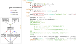

[Back](../README.html) to main doc.

---

Adding new pipeline rules
-------------------------

---

If you want to integrate another tool into the pipeline or add a piece of analysis it is easy to write a new rule in the respective pipeline file (mapping pipeline: `mapping_pipeline.snake`, DE pipeline: `DE_pipeline.snake`).
The pipeline is using Snakemake as a workflow engine and you can follow the [`Snakemake documentation`](https://snakemake.readthedocs.io/en/stable/) when extending it.

In the following the structure of rules and a few conventions for the pipelines in SeA-SnaP are explained that should be followed to keep the rules uniform and easy to understand.
When starting to add new rules it is best to look at existing rules as an example.
In addition in `templates/rule_template.txt` a template is given that can be copied (parts that should be replaced are marked).

The following figure shows a rule template on the right, where `<name>` has to be the name of the rule:

<p align="center">
  
</p>

\
The pipeline path handlers defined in `tools/` provide a generic interface for rules to exchange input- and output-files, while their folder structure can be configured independently in the config file.
Thus, it is important to use the path handler methods to define inputs and outputs of new rules, but in order to add new rules to the pipeline you will only need 1-3 methods of the path handler in most cases, which are described below.

---

**1) file_path(step, extension, log=False, ...)**

`file_path` will probably be most commonly used.
It fills the output- or log- (if `log==True`) [`path pattern`](#path_pattern) wildcards with values.

The rule name `step` and the `extension` of the produced file must always be provided in the rule definition, e.g.:

```
ph.file_path(step="salmon", extension="sf")
```

Other wildcards will by default be kept inside of the path pattern, so that Snakemake can match and fill them automatically.
But in cases in which a rule does not distinguish a wildcard it can be provided to `file_path`.
E.g. `salmon_index` (creation of an index for Salmon) does not distinguish different samples (wildcard `sample`).
Therefore

```
ph.file_path(step="salmon_index", extension="sa.bin", sample="all")
```

can be used.
Wildcards that are not always used can be fixed as well, e.g. `lane="all"`, and will be ignored if not present.

*Note: Although wildcard values usually must not contain `/` or `.`, since these are used to separate them, `extension` can contain points. If a rule produces several files with the same extension, you can distinguish them by adding a prefix to the extension, e.g. `extension="table1.tsv"`.*

---

**2) expand_path(step, extension)**

`expand_path`, like `file_path`, fills the wildcards `step` and `extension` and then returns a list of file paths for either all samples (mapping pipeline) or all contrasts (DE pipeline).
Additional wildcards can also be fixed, e.g. `lane="all"`.

---

**3) choose_input(choice_name, options)**

`choose_input` can be used in cases, when different rules can produce an output that can be an input for another rule.
Hence, if a rule you write can produce an output that is an alternative to that produced by another rule, you can add your rule to the input of the consuming rule with `choose_input`.

The `choice_name` is a string with a keyword that is used to distinguish different options.
`options` is a list of dictionaries that each define one input file.
The dictionaries should contain key-value pairs that define the parameters of `file_path`.

```
ph.choose_input("tab_from", [dict(step="ruleA", extension="tsv"), dict(step="ruleB", extension="tsv")])
```

for example defines that input comes either from `ph.file_path("ruleA", "tsv")` or `ph.file_path("ruleB", "tsv")` depending on the key "tab_from".

There are two ways how a key can be defined:

- if a wildcard with the key name is present in the path pattern, e.g. `{tab_from}` in our case, this wildcard will be used to choose the option.
- otherwise, an entry in the config file `pipeline_param: input_choice: tab_from: <value>` is used.

If the wildcard value or config entry is 'ruleA' the file path for `ruleA` will be used, and equivalently `ruleB`, if the value is 'ruleB'.
The config entry can be a list. If a wildcard was provided, it is expanded over the list values. Otherwise, if no wildcard is present, the first list entry will be used for the decision.

*Note: usually `choose_input` should only be used for rule inputs (as the name suggests) to keep the pipeline straightforward. If a rule can produce two alternative outputs, consider splitting it into two rules.*

---

**rule structure**

Finally, here are some conventions to keep the rule structure uniform:

- if possible keep all code inside of the rules `run` block
- in the run block a (multi-line) string with the script (e.g. sh or R) is defined
- in R add a sessionInfo() or print the version number in sh
- use R with the --vanilla option to prevent loading any settings
- there is one log file to catch the output and error messages produced when the rule is running
- other log files are automatically generated:
    - with the script defined in the rule as it was executed
    - a yaml file with configuration used to produce the results
    - the conda environment under which the results were produced
    - information about the status of the git repository is also logged
- the script is executed with the shell() command

---

[Back](../README.html) to main doc.