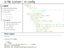

[Back](../README.html) to main doc.

---

Adding Rmd snippets
-------------------

---

If you are using the DE pipeline, you will probably want to extend the (auto-)generated report to add your own analysis.
When you do so, it may be useful to save your code in the form of an own snippet, which allows you to easily reuse it or share it with others.

To save your code as a snippet, simply have a look at other snippets in `report/`.
There is also a folder `templates/` in the main directory of the git repository, which contains templates for Rmd snippets.

---

### report generation

First, let's look how the report is assembled from snippets to understand the structure of the `report/` directory.
An example of a report directory with contained files and an example of the report section in the config file are shown in the following figure:

<p align="center">
  
</p>

\
The algorithm that generates the report reads the file called `report/report_main_template.Rmd` and finds a place inside of it where to insert snippets. 
Then, it traverses the list at the first level of the 'building plan' in the config file (`report: report_snippets:`) and inserts the contents of the respective .Rmd snippets, as long as they are strings specifying the name of a valid snippet.

If an entry of the list is a dictionary, the algorithm will search for a folder with the name of the dictionary key, e.g. `contrast`, and open a file called <folder>_main_template.Rmd, in our case `contrast_main_template.Rmd`.
It will then recursively go through the list specified under `report: report_snippets: contrast:` and insert snippets into the template as long as they are strings and go into new subfolders, if they are dictionaries.
If a dictionary with the special key `__list__` is read, a list of contrasts with individual reports will be inserted in the template.
The algorithm will create this list based on the *contrast names* given as values in the dictionary in the config file, e.g. `5xFAD vs control in hip (2 months)`.
For each *contrast name* a list of sub-snippets is inserted in the report, that are available in the folder `report/contrast/`.

If the *contrast name* is a string, a sub-snippet list from `report: defaults: contrast:` in the config will be loaded and inserted.
If the *contrast name* is a dictionary, the list inside of the dictionary will be used.

Should any of the .Rmd snippets corresponding to a *contrast name*, be specified as a dictionary and not as a string, the algorithm would try to continue recursively assembling lists of sub-sub sections of the report from sub-sub folders in `report/contrast/etc/`.

Therefore, if you write a new Rmd snippet and want to make it available for the report generation, make sure to place it in the corresponding sub-folder. (`report/` for first level snippets, `report/contrast/` for snippets analyzing contrasts, etc.).

Sub-folders will usually correspond to sub-sections in the report.

There is also an example for configuring the report [here](config_examples1.html).

---

### accessing pipeline results in snippets

**1) files **

Within Rmd snippets you will need to access the results of the pipeline execution, which are stored in files at paths determined by the given path pattern in the config file.
There are two ways to get the paths of such files from within a snippet:

```
file <- {{DESeq2-rds}}
```

When the report is generated, wildcards in double-braces `{{...}}` will be filled.
In this case the pattern `` will be replaced by the path to the '.rds' file produced by the rule 'DESeq2'.
The final report will then contain the full file path instead of `{{DESeq2-rds}}`.

```
file <- subset(file_tab, step=="<rule_name>" & extension=="<file_extension>")$filename
```

With the report a table of all files produced by the pipeline is written.
This table is loaded in `report_main_template.Rmd` as a data frame called `file_tab` and is therefore accessible in all snippets.

The second option is prefereable, since it is easier to adapt after the report was generated.

**2) contrast names**

For sub-snippets you will also need the names and IDs of contrasts (as filled into wildcards by Snakemake) to access results.
Hence, during report generation `{{ENTRY_NAME}}` and `{{ENTRY_ID}}` will be filled by the corresponding contrast name and ID respectively.
And therefore

```
file <- subset(file_tab, step=="..." & extension=="..." & contrast=="{{ENTRY_ID}}")$filename
```

can be used.

**3) config parameters**

Also the config file is loaded in `report_main_template.Rmd` and its contents can be accessed with:

```
parameter <- config$<key1>$<key2>[$...]
```

**4) external code**

The R code in `report/R_common/` in the files `basic_funcs.R` and `basic_plots.R` is also loaded at the beginning of the report.
There you can write functions in R to perform generic computations and plotting that can be used in Rmd snippets.

**5) other**

Also the wildcards `{{WORKING_DIRECTORY}}` and `{{R_COMMON}}` are replaced by paths to the respective folders in the complete document.
Note, that the working directory of the Rmd report will be set to the working directory of the pipeline.
Thus, moving the report file is less likely to break paths to the results files.
If some files are not found, you may change the setting of the working directory in `report_main_template.Rmd` or RStudio, e.g. if you copied the report to your local computer and want to knit it accessing files via sshfs.

---

[Back](../README.html) to main doc.