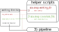

[Back](../README.html) to main doc.

---

Run differential expression analysis
------------------------------------

---

<p align="center">
  
</p>

---

### 1) edit the config file

After creating a working directory with the file `DE_config.yaml` you have to edit that file to set your configuration.

SeA-SnaP parses an internal config file with default values from the git repository first and the files you edit in your working directory will overwrite the default values.
In this way the config can be kept simple and you do not need to specify all values.

Many configuration options are available described in a [`separate section`](../config_options.html).
(Hint: it might also be helpful to look into the default configuration file in the [git repository](../defaults/DE_config_defaults.yaml)).

Here, we describe the minimal settings required:

**required settings**

In the config file which was copied to your working directory values that need to be filled are marked with `### FILL IN ###`.
For other sections of the config file `__options__` gives hints to which further adjustments can be made.
But you can also completely delete these other sections, if not required.

At least you need to specify:

- An organism after `organism_defaults:`. This will load the default settings for this organism, which you can overwrite by filling `organism:`. Note: some paths to static GTF, FA, etc. files on the CUBI cluster are set by default. Quite likely you will need to overwrite them. If there are no defaults for your organism, you can also leave `organism_defaults:` blank and only fill `organism:`.
- A `design_formula`
- A `contrast_list`
- If you want to generate a covariate file automatically, you also need an input folder structure. It can be identical to the output folder structure of the mapping pipeline, if both pipelines are run subsequently.

Folder structures for input and output files in SeA-SnaP are specified by *path patterns with wildcards*, e.g.:

```
mapping/{step}/{sample}/out/{step}.{mate}.{extension}
```

See [`path patterns`](path_patterns.html) for a detailed description.

[Here](path_patterns.html) are also examples how to configure the `contrast list` and customize the Rmd report.

---

### 2) create a covariate file

You will need a covariate file describing the input data.
It is a tab-delimited file with at least five columns:

| filename  | md5 |   group         | replicate   |      label    |
| --------- | --- | --------------- | ----------- | ------------- |
| file path | ... | e.g. 'Cor_2_WT' | e.g.    '1' |  'Cor_2_WT_1' |

(Note: at the moment only `filename` and `group` are actually used. Others might be blank.)

To auto-generate a covariate file from the input path pattern defined in the config file, run:

```
./sea-snap covariate_file <step> <extension>
```

With e.g. \<step\>='salmon' and \<extension\>='sf' this would parse all files matching the wildcards `step` and `extension` with 'salmon' and 'sf' respectively.
You can also directly add additional columns using the `--col` option.

If you add `import_sf` to `config: pipeline_param: input_choice: mapping:`, you will need a covariate file for Salmon sf files. 
Likewise, if you add `import_gene_counts` to `config: pipeline_param: input_choice: mapping:`, you will need a covariate file for STAR gene_counts.tab files.
if you add `import_featurecounts`, you will also need a covariate file for STAR, in this case the output of the `FeatureCounts program`.

You can set individual covariate files for Salmon and STAR under `config: experiment: covariate_file:` (see [Config options](#config-options))

*Note: when using auto-generation, check the file after it was created and edit if necessary!*

---

### 3) execute the pipeline

To run the mapping pipeline locally you can use:

```
./sea-snap DE l
```

This is a wrapper for Snakemake.
You can add any [`snakemake options`](https://snakemake.readthedocs.io/en/stable/executable.html#all-options) after `l` and they will be passed to snakemake.

E.g. run

```
./sea-snap DE l -nr
```

for a dry run to see which steps will be executed and why.
Other helpful options might be `-R`, `-U` and `-O` to run only specific parts of the pipeline.

---

To run the pipeline on the cluster, type:

```
./sea-snap DE c
```

instead of `l`.

Also note the file `cluster_config.json`, which was added to the working directory together with `mapping_config.yaml` and `DE_config.yaml`.
It will be used if SeA-SnaP runs with the cluster option.
In the file, resources for the different pipeline steps are defined.

In addition, the file contains an object `__set_run_command__` where default [`snakemake options`](https://snakemake.readthedocs.io/en/stable/executable.html#CLUSTER) are defined for running the pipeline on the cluster.
You can adapt these to your needs.
E.g. per default `--drmaa` is used to submit jobs to other nodes.

When a job was submitted to the cluster you can run

```
tail -f pipeline_log.out
```

to follow the progress (press `ctrl-c` to exit).

A list of all options for the `./sea-snap` command is given in section [`SeA-SnaP options`](../README.html#sea-snap-options).

---

[Back](../README.html#running-the-pipeline) to main doc.